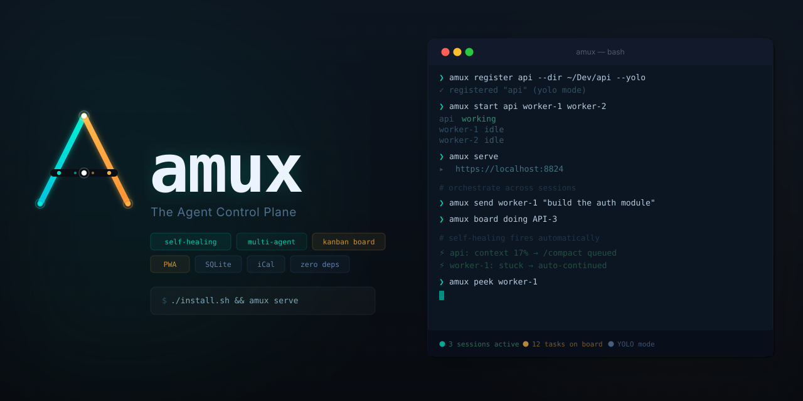

<p align="center">
  <a href="https://github.com/mixpeek/amux/stargazers"></a>
  <a href="https://github.com/mixpeek/amux/blob/main/LICENSE"></a>
  <a href="https://amux.io"></a>
  <a href="https://apps.apple.com/us/app/amux-agent-multiplexer/id6760410435"></a>
  <a href="https://amux.io/changelog/"></a>
</p>

**amux is a multi-session agent orchestrator.** Run dozens of parallel AI agent workers (Claude Code, Codex, Gemini CLI) from a web dashboard or your phone: a shared kanban board with status gates, schedulers, inter-worker messaging, per-scope memory and environment, browser automation, email, and self-healing recovery. Local-first, self-hosted, SQLite-backed.

> **[amux.io](https://amux.io)** · [Getting started](https://amux.io/guides/getting-started/) · [FAQ](https://amux.io/faq/) · [Blog](https://amux.io/blog/)

<p align="center"><a href="https://amux.io"></a></p>

## Quickstart — one command

```bash
git clone https://github.com/mixpeek/amux && cd amux && ./install.sh
```

That is the whole setup. The installer checks prerequisites (Rust toolchain, tmux; it prompts before installing anything), builds the workspace, installs the server and CLI to `~/.local/bin`, loads the launchd agents on macOS, mints `~/.amux` (DB, TLS, auth token) on first boot, waits for `/health`, and prints:

```
Dashboard   https://localhost:8824
Auth token  ~/.amux/auth_token
CLI         amux-rs --url https://localhost:8824 health
```

Open **https://localhost:8824**, accept the self-signed cert warning once, and add your first worker from the dashboard. Re-running `./install.sh` upgrades in place and never touches your data; `./uninstall.sh` removes the binaries and agents and leaves `~/.amux` alone.

**Requirements:** macOS (primary; on Linux the installer builds and installs the binaries and prints how to run the server), tmux 3.2+, and at least one of Claude Code, Codex CLI, or Gemini CLI. The Rust toolchain is installed via rustup if you don't have it (with your confirmation).

> **License:** [MIT + Commons Clause](LICENSE) — free to use, modify, and self-host. Commercial resale requires a separate license.

## Which server is real?

**The Rust server (`crates/amux-server`, port 8824).** That is what `./install.sh` installs, what the dashboard talks to, and where all new work lands. Every `/api` family answers natively; the live proof is `GET /api/debug/boundary`, which reports `proxied: []`. If you are reading code, start in `crates/` — it is the only server code in the tree. The same binary also answers the retired port 8822 while a compatibility bind survives (see [Legacy](#legacy-the-python-server)), so there is no second server to reason about; the Python predecessor is gone.

## Architecture

One Rust workspace, four crates:

| Crate | What |
|---|---|
| `crates/amux-server` | The server: axum HTTP API on **8824** (HTTPS, self-signed; plain HTTP redirected), single-writer SQLite store with an event journal, SSE + delta sync, scheduler/orchestrator runtime, embedded dashboard |
| `crates/amux-dashboard` | The SPA, embedded into the server binary at build time (no node/npm needed) |
| `crates/amux-cli` | `amux-rs`, the CLI (board, workers, send, schedules, health) |
| `crates/amux-core` | Shared domain types: ids, scopes, revisions, memory, protocol |

Everything in amux is built on **eight primitives**, and new capability is expressed by composing them rather than wrapping them:

- **board** — shared kanban with atomic claiming, types, and status gates (`done` ≠ `verified`)
- **workers** — parallel agent sessions (tmux by default), each with durable identity
- **schedulers** — cron-style recurring and one-shot jobs with an audited run history
- **filesystem** — browse/edit/search any worker's working directory; file viewer + media pipeline
- **groups** — tags on workers; scoping for visibility, gates, memory, and env (workers see same-group peers)
- **memories** — layered instructions/knowledge composed global → group → worker
- **environment** — layered env vars the same way (which 3p APIs a worker can reach)
- **messages** — inter-worker and human-to-worker text, delivered at turn boundaries

The uniform way to read/write per-scope configuration (memory, rules, env, board gates, status availability at global/group/worker level) is one endpoint: `GET`/`PUT /api/scope`.

Useful pointers:

- **Server boundary / migration status:** [docs/rust-migration/server-boundary.md](docs/rust-migration/server-boundary.md) — the full ownership matrix (all families RUST-NATIVE, zero proxied) and the contract subtleties, cross-checked by tests and served live at `/api/debug/boundary`.
- **Cutover runbook:** [docs/rust-migration/cutover-runbook.md](docs/rust-migration/cutover-runbook.md) — the gates for retiring the Python server.
- **Rebuild plan:** [docs/rust-rebuild-plan.md](docs/rust-rebuild-plan.md).

### Terminal backends: tmux, herdr, and the structured protocol

tmux is the default and fully supported backend. Sessions can instead run on [herdr](https://github.com/herdrdev/herdr): set `AMUX_HERDR_SESSION=<herdr session name>` in `~/.amux/server.env` (the herdr session that hosts amux workspaces; workers opt in per-session with `CC_BACKEND=herdr`). The herdr path is not covered by CI (its tests mock the process boundary), so treat a green build as proving backend selection, not the integration.

Longer term, terminal scraping is the fallback, not the plan: the `opencode` module (`crates/amux-server/src/opencode/`) defines the structured AgentProtocol through which prompts, messages, cancellation, and state queries flow directly, shrinking the scraper to a liveness check as coverage grows.

## Logs and the daily sweep

Every `/api` request is recorded in a structured request log (`_amux_request_log`, served at `GET /api/logs` and the dashboard's Logs tab; raw server tracing at `~/.amux/logs/server-rs.log`; retention `AMUX_REQLOG_RETAIN_DAYS`, default 14 days).

On top of it sits a **daily log sweep**: a scheduler entry that prompts a session to run five standing queries (error families, latency p95 vs trailing norm, proxy volume — which must stay zero, auth-failure spikes, and worker-log anomalies), judge the results, and file board cards. The contract lives in [docs/rust-migration/log-sweep.md](docs/rust-migration/log-sweep.md). It is a contract for a model, not an automation: amux supplies the queries and the substrate; the session supplies the judgment.

## CLI

`amux-rs` finds the server via `--url`, then `$AMUX_RS_URL`, then `$AMUX_URL` (every running amux session has it), falling back to `https://localhost:8824` — the port `./install.sh` configures. So a bare invocation just works:

```bash
amux-rs health                                        # no env or flags needed
amux-rs board add "task title" --type code
amux-rs board list --status todo
amux-rs board doing PROJ-1
amux-rs board done PROJ-1 --checked "Tests / lint pass"   # gates are surfaced loudly, never bypassed silently
amux-rs workers list
amux-rs send worker-1 "implement the login endpoint and report back"
amux-rs schedules list
```

Board mutations are gate-aware: a 409 from a status gate prints the checklist and the exact retry command instead of failing silently.

## Configuration

Server configuration lives in `~/.amux/server.env` (plain `KEY=value`; process env wins). Highlights:

| Variable | What |
|---|---|
| `AMUX_RS_PORT` | server port (installer sets 8824) |
| `AMUX_HOME` | data dir (default `~/.amux`) |
| `AMUX_DB` | SQLite path (default `$AMUX_HOME/amux.db`) |
| `AMUX_HERDR_SESSION` | herdr session hosting amux workspaces (enables the herdr backend) |
| `AMUX_REQLOG_RETAIN_DAYS` | request-log retention (default 14) |
| `AMUX_SCOPE_WRITE_AGENTS` | `1` lets agent sessions write group/global scope layers (default: only their own worker layer) |

[`server.env.example`](server.env.example) documents the full set. Never commit your real `server.env` — several values are secrets.

## Naming

A **worker** is one agent lane. A **group** is a label shared by several workers; workers see and coordinate with same-group peers. The HTTP API and env vars still carry the older `session`/`tag` spellings (`/api/sessions`, `X-Amux-Session`, `CC_TAGS`); renaming them would break every running worker at once, so the wire names migrate behind aliases. Worker = session, group = tag, wherever you see them in a request.

## Security

Local-first. Auth is a bearer token minted at `~/.amux/auth_token` (localhost callers are exempt). **Never expose port 8824 to the internet** — use [Tailscale](https://amux.io/guides/remote-access-tailscale/) for phone/remote access, or the [amux tunnel](https://amux.io/features/tunnel/) for deliberately-public endpoints (tunneled URLs are unguessable, not authenticated). Report vulnerabilities privately per [SECURITY.md](SECURITY.md).

---

## LEGACY: the Python server

> The Python predecessor (`amux-server.py`) was **removed at commit `792ce1f`** (2026-08-09) — git history has it, and [docs/rust-migration/](docs/rust-migration/) records how the Rust server replaced it (the Rust binary also answers the legacy 8822, but that bind is a countdown, not an address — `GET /api/debug/legacy-port` reports who still calls it and when it can be dropped. Use 8824).
> `cloud/` still runs the last-built Python image pending its own Rust migration; do not build anything new on it.
> Historical install channels that shipped Python (`pipx install amux`, Homebrew) are retired — install with `./install.sh`.

---

## Roadmap & contributing

amux is growing into the durable operating system around agents: it owns execution, state, isolation, recovery, observability, and verification, so the model only has to own reasoning. The plan lives in [the roadmap epic (#46)](https://github.com/mixpeek/amux/issues/46); the seams are maintainer-owned, and the leaves they unlock (provider adapters, verification runners, MCP tools, eval scenarios, policy hooks) are great contributor work. See [CONTRIBUTING.md](CONTRIBUTING.md) and the [`help wanted`](https://github.com/mixpeek/amux/labels/help%20wanted) issues.

## Resources

- [Getting started](https://amux.io/guides/getting-started/) · [Running 10+ agents](https://amux.io/guides/running-10-plus-agents/) · [Agent-to-agent orchestration](https://amux.io/guides/agent-to-agent-orchestration/) · [REST API reference](https://amux.io/guides/rest-api-reference/)
- [Board system guide](docs/guide.md) (columns, types, gates, `done` vs `verified`)
- [Remote control over Tailscale](REMOTE.md) · [Calendar sync](docs/calendar-sync.md)
- [How amux compares](https://amux.io/compare/) · [Use cases](https://amux.io/use-cases/) · [FAQ](https://amux.io/faq/)
- iOS app: [App Store](https://apps.apple.com/us/app/amux-agent-multiplexer/id6760410435) · Managed onboarding: [amux.io/concierge](https://amux.io/concierge/)

If amux saves you time, a ⭐ helps others find it.

[](https://star-history.com/#mixpeek/amux&Date)
